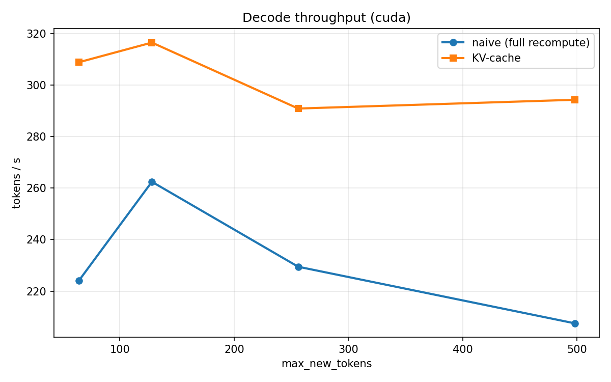
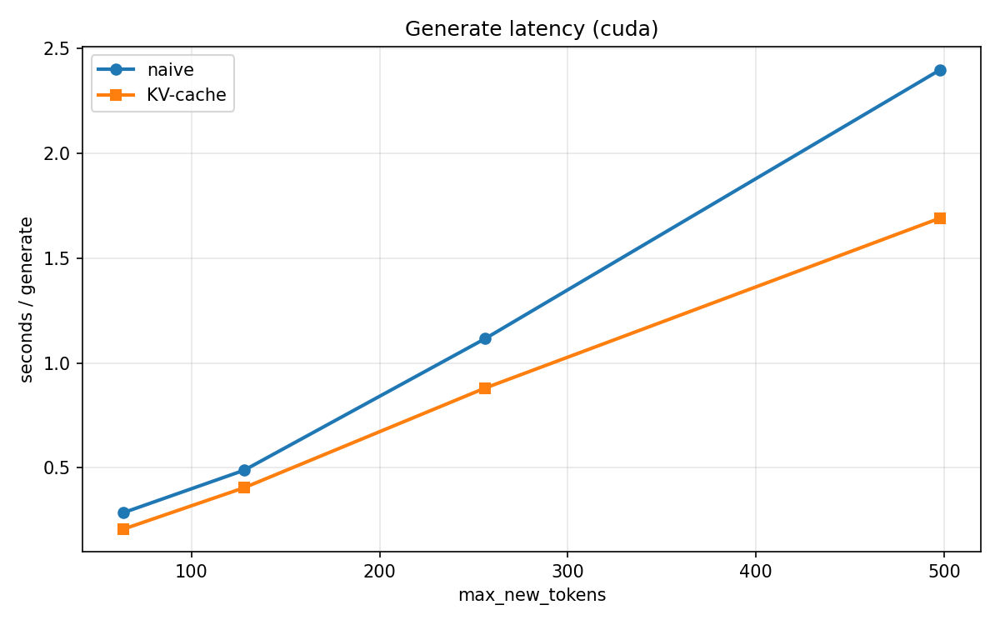
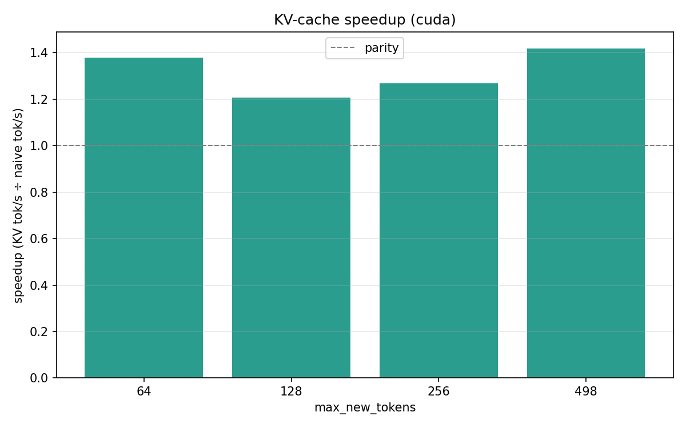

# GPT from Scratch

Small Generative Pre-trained Transformer (GPT) in PyTorch


## What's in the project

| File | Role |
|------|------|
| `src/model.py` | Embeddings, Transformer blocks (masked self-attention + FFN), generation |
| `src/dataset.py` | Text tokenization (tiktoken GPT-2) → `.bin` file, memmap-backed dataset |
| `src/train.py` | Training loop, checkpoints, generation samples |
| `src/generate.py` | Load a checkpoint and generate text |
| `src/benchmark.py` | Naive vs KV-cache generate timing |
| `src/plot_kv_benchmark.py` | Benchmark + PNG/CSV charts |
| `src/config.py` | Configuration from `.env` |
| `data/raw/` | Raw text and tokenized `.bin` files |
| `checkpoints/` | Saved weights |
| `plots/` | KV-cache benchmark figures |

## Setup

```bash
python3 -m venv .venv
source .venv/bin/activate
pip install -r requirements.txt
cp .env.example .env
```

Put a text file in `data/raw/` (e.g. `pan-tadeusz.txt`) and set the output token file name in `.env` (`TOKEN_FILE`).

## Configuration (`.env`)

Main variables:

- `TOKEN_FILE` - name of the token `.bin` file (e.g. `pan_tadeusz.bin`)
- `MAX_SEQ_LEN` - context length
- `EMBEDDING_DIM`, `BLOCK_NUM` - model size
- `VOCAB_SIZE` - `50257` for tiktoken GPT-2
- `batch_size`, `learning_rate`, `num_epochs`

For a small corpus (e.g. a single book), a sensible starting point is `MAX_SEQ_LEN=256`, `EMBEDDING_DIM=256`, `BLOCK_NUM=4–6`.

## Training

From the project root:

```bash
python3 src/train.py
```

If `data/raw/$TOKEN_FILE` is missing, the script tokenizes the data first. Every 5000 steps it saves a checkpoint to `checkpoints/`.

## Generation

Set the checkpoint path in `src/generate.py`, then:

```bash
cd src && python3 generate.py
```

Training checkpoints are saved as a dict - load weights with `ckpt["model"]`.

## KV-cache benchmark

Decoder generation with and without KV-cache (`use_kv_cache=True/False`). Regenerate plots:

```bash
python3 src/plot_kv_benchmark.py
```

Outputs land in `plots/` (`*.png`, `kv_benchmark.csv`).

Example results (CUDA, SFT checkpoint):

| max_new_tokens | naive tok/s | KV-cache tok/s | speedup |
|----------------|-------------|----------------|---------|
| 64 | 224 | 309 | 1.38× |
| 128 | 262 | 317 | 1.21× |
| 256 | 229 | 291 | 1.27× |
| 498 | 207 | 294 | 1.42× |

### Throughput



### Latency



### Speedup



## Notes

- Tokenization uses **tiktoken** (`gpt2`); tokens are stored on disk as `uint16`.
- The dataset builds next-token-prediction windows via memmap (saves RAM).
